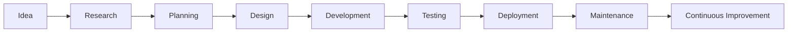

<div align="center">

#  Hi, I'm M. Farhan Habib


<h3>
Building AI-powered solutions that solve real-world problems through Machine Learning, Flutter, Python, and Modern Software Engineering.
</h3>

<p align="center">


</p>

</div>

---

# 🌌 About Me


### 👨‍💻 AI Developer

I am an aspiring **Artificial Intelligence Engineer** passionate about building intelligent software that combines **Machine Learning**, **Deep Learning**, **Computer Vision**, and **Modern Application Development**.

I enjoy transforming complex problems into scalable software solutions while continuously learning emerging technologies in Artificial Intelligence and Cloud Computing.

My engineering philosophy revolves around:

- Clean Architecture
- Scalable Software
- AI-first Development
- Production Ready Code
- Continuous Learning
- Open Source Contribution
- Problem Solving
- User-Centered Design

---

## 🚀 Current Focus

- 🤖 AI Agents
- 🧠 Machine Learning
- 🔥 Deep Learning
- 📱 Flutter Development
- 🐍 Python Engineering
- 🎮 Game Development using SFML
- ☁️ Cloud Computing
- ⚡ Automation

---

# 🎯 Professional Summary

```yaml
Name: M. Farhan Habib

Role:
  AI Developer

Currently Learning:
  - AI Agents
  - Machine Learning
  - Deep Learning
  - Flutter
  - Python
  - Cloud Computing

Interested In:
  - Artificial Intelligence
  - Computer Vision
  - Software Engineering
  - Mobile Development
  - Web Development
  - Game Development

Working As:
  Freelance Web Developer

Mindset:
  "Build. Learn. Improve. Repeat."
```

---

# 💻 Programming Languages

<p align="center">


</p>

---


# 📱 Mobile Development

<p align="center">


</p>

---


# 🌐 Web Development

<p align="center">


</p>

---


# 🤖 Artificial Intelligence

<p align="center">


</p>

<div align="center">

Machine Learning • Deep Learning • Computer Vision • AI Agents • Neural Networks • LLMs • Prompt Engineering

</div>

---


# ☁️ Cloud Platforms

<p align="center">


</p>

---
---


# 🗄 Databases

<p align="center">


</p>

---


# ⚙️ Developer Tools

<p align="center">


</p>

---


# 🎨 Creative Tools

<p align="center">


</p>

---

# 🧠 Engineering Skills

| Category | Technologies |
|-----------|-------------|
| Languages | C, C++, C#, Python, Dart |
| AI | Machine Learning, Deep Learning, PyTorch |
| Mobile | Flutter |
| Cloud | AWS, Google Cloud, Oracle Cloud |
| Backend | Python |
| Database | MySQL, SQL Server |
| Version Control | Git, GitHub |
| IDE | VS Code |
| API Testing | Insomnia |
| Game Development | SFML |
| Graphics | Photoshop, Illustrator, Blender |

---

# 🔥 Core Strengths

✅ Artificial Intelligence

✅ Machine Learning

✅ Deep Learning

✅ Flutter Development

✅ Python Development

✅ Cloud Computing

✅ Web Development

✅ Problem Solving

✅ Software Design

✅ Game Development

---

# 💡 Engineering Philosophy

> Great software is not just about writing code.

> It is about solving problems, creating value, and continuously improving through learning and innovation.

---

# ⚡ Fun Facts

- 🤖 Passionate about Artificial Intelligence
- 🎮 Love building games with SFML
- 📱 Enjoy Flutter app development
- 🌐 Build responsive websites
- ☁️ Exploring Cloud Computing
- 📚 Always learning modern technologies
- 🚀 Believe consistency beats talent

---
# 💼 Professional Experience

## 🚀 Freelance Web Developer | Fiverr

**Role:** Freelance Web Developer

As a freelance developer, I have worked on building modern websites and client-focused solutions while improving my software engineering, communication, and problem-solving skills.

### Responsibilities

- 🌐 Developed responsive websites
- 🎨 Designed modern UI layouts
- ⚡ Improved website performance
- 🔍 Debugged production issues
- 📱 Optimized websites for mobile devices
- 🤝 Collaborated with clients to deliver customized solutions
- 🛠 Maintained and enhanced existing web applications

### Engineering Skills Applied

- Requirement Analysis
- Frontend Development
- Performance Optimization
- Client Communication
- Version Control
- Responsive Design
- Software Debugging

---

# 🚀 Featured Projects

---

## 🛍 LuxeMart — Modern E-Commerce Website


### Overview

LuxeMart is a modern e-commerce platform focused on delivering a clean shopping experience with responsive design and scalable architecture.

### Tech Stack

- HTML
- CSS
- JavaScript
- MySQL
- Apache

### Key Features

- Responsive UI
- Product Catalog
- Shopping Experience
- User-Friendly Navigation
- Clean Design
- Mobile Optimization

### Engineering Highlights

- Modular Design
- Responsive Layout
- Scalable Structure
- Optimized Performance
- Maintainable Codebase

---

## 👗 Luxe Boutique


### Overview

A fashion boutique website designed with an elegant interface and seamless browsing experience.

### Technologies

- HTML
- CSS
- JavaScript

### Features

- Beautiful Product Showcase
- Responsive Design
- Interactive UI
- Optimized Layout
- Modern Styling

### Focus Areas

- UI/UX
- Performance
- Accessibility
- Responsive Development

---

## ♟ Chess Game using SFML


### Overview

A desktop chess game developed using C++ and SFML that demonstrates object-oriented programming principles and game logic implementation.

### Technologies

- C++
- SFML

### Features

- Interactive Chess Board
- Piece Movement
- Collision Detection
- Game Logic
- Clean Object-Oriented Architecture
- Desktop GUI

### Engineering Challenges

- Chess Movement Logic
- Event Handling
- Object-Oriented Design
- Rendering Optimization
- Game State Management

---

# ⚙ Engineering Capabilities

### Artificial Intelligence

- Machine Learning
- Deep Learning
- AI Model Development
- Computer Vision Fundamentals
- PyTorch
- Data Processing

---

### Software Engineering

- Object-Oriented Programming
- Modular Development
- Clean Code
- Debugging
- Software Design Principles

---

### Mobile Development

- Flutter
- Dart
- Responsive Interfaces
- Cross-Platform Development

---

### Cloud Technologies

- AWS
- Google Cloud
- Oracle Cloud
- OpenStack

---

### Database Engineering

- MySQL
- Microsoft SQL Server

---

### API & Testing

- REST API Testing
- Insomnia
- API Debugging

---

# 🏆 Achievements

🥇 IEEE Society Hackathon

**Best Problem Solver Award**

Recognized for analytical thinking, innovative problem solving, and teamwork during the IEEE Society Hackathon.

---

☁ AWS & Cloudflare Competition

Participated in the **Vibe Coding Competition**, exploring cloud technologies, software development practices, and collaborative engineering.

---

🎓 Academic Achievement

Maintained a **3.0 GPA** while continuously improving technical expertise through self-learning and practical development.

---

# 📜 Certifications

| Organization | Certification |
|--------------|--------------|
| Cisco | Introduction to Modern AI |
| IBM | Introduction to Cybersecurity Essentials |
| Google | Automate Cybersecurity Tasks with Python |
| Google | Tools of the Trade: Linux and SQL |
| Google | Assets, Threats, and Vulnerabilities |

---

# 💡 Technical Interests

- Artificial Intelligence
- Machine Learning
- Deep Learning
- Computer Vision
- AI Agents
- Python Engineering
- Flutter
- Cloud Computing
- Mobile Applications
- Automation
- Software Engineering
- Game Development

---

# 🧩 Competitive Programming

| Platform | Username |
|----------|----------|
| HackerRank | **@mfarhanhabib776** |
| LeetCode | Coming Soon |
| Codeforces | Coming Soon |
| CodeChef | Coming Soon |
| GeeksforGeeks | Coming Soon |

---

# 📈 Professional Highlights

✔ Freelance Web Development Experience

✔ AI Developer

✔ Flutter Developer

✔ Python Developer

✔ C++ Developer

✔ SFML Game Developer

✔ Machine Learning Enthusiast

✔ Deep Learning Enthusiast

✔ Cloud Computing Learner

✔ Responsive Web Design

✔ Modern UI Development

✔ API Testing

✔ SQL Databases

✔ Problem Solver

✔ Team Collaboration

✔ Continuous Learning

---

# 🌱 Currently Exploring

- 🤖 AI Agents
- 🧠 Large Language Models (LLMs)
- 🔥 Deep Learning
- 📱 Flutter Advanced Concepts
- 🐍 Advanced Python
- ☁ Cloud Computing
- 🏗 System Design
- ⚡ Software Architecture
- 🧩 Design Patterns
- 🚀 Production-Ready AI Applications

---

# 💬 Favorite Engineering Principles

> **Write code for humans first, computers second.**

> **Keep learning. Keep building. Keep improving.**

> **Small improvements every day lead to extraordinary engineering skills.**
---

# 📊 GitHub Analytics

<div align="center">


</div>

---

# 🔥 GitHub Streak

<div align="center">


</div>

---

# 📈 Contribution Activity Graph

<div align="center">


</div>

---

# 🏆 GitHub Trophies

<div align="center">


</div>

---

# 📋 GitHub Profile Summary

<div align="center">


</div>

<div align="center">


</div>

<div align="center">


</div>

---

# 🐍 Contribution Snake

<div align="center">


</div>

> **Note:** Enable this after creating the GitHub Action that generates the snake animation.

---

# ⚡ Development Workflow

```text
          Idea
            │
            ▼
      Requirement Analysis
            │
            ▼
      Software Design
            │
            ▼
      Development
            │
            ▼
      Testing & Debugging
            │
            ▼
      Deployment
            │
            ▼
      Continuous Improvement
```

---

# 🧠 Engineering Mindset

```text
Problem Solving        ████████████████████

Python                 ██████████████████

Artificial Intelligence██████████████████

Flutter                ███████████████

C++                    █████████████████

Machine Learning       ███████████████

Cloud Computing        █████████████

Web Development        ███████████████

Game Development       ██████████████
```

---

# 🎯 2026 Goals

- ✅ Build production-ready AI applications
- ✅ Master Machine Learning & Deep Learning
- ✅ Develop intelligent AI Agents
- ✅ Publish impactful GitHub projects
- ✅ Improve Flutter expertise
- ✅ Learn advanced System Design
- ✅ Strengthen Cloud Computing skills
- ✅ Contribute to Open Source
- ✅ Solve more coding challenges
- ✅ Build a strong developer portfolio

---

# 🤝 Let's Connect

<div align="center">

<a href="mailto:mfarhnahabib776@gmail.com">

</a>

<a href="https://www.linkedin.com/in/muhammad-farhan-habib-310ab6384/">

</a>

<a href="https://github.com/farhanhabib01">

</a>

<a href="https://www.hackerrank.com/profile/mfarhanhabib776">

</a>

</div>

---

# 💙 Open Source Philosophy

> **"Every line of code is an opportunity to learn, improve, and create something meaningful."**

I believe that continuous learning, collaboration, and sharing knowledge are the foundations of great software engineering. My goal is to build impactful applications while growing as an AI Engineer and contributing to the developer community.

---

# ☕ Support My Work

If you enjoy my projects or find them helpful:

⭐ Star my repositories

🍴 Fork projects

🤝 Collaborate on ideas

💬 Share feedback

---

<div align="center">

## 🚀 Thanks for Visiting!


### ⭐ If you like my work, don't forget to follow me!


</div>
---

# 🏛 Engineering Principles

<div align="center">

| Principle | Description |
|------------|-------------|
| 🧩 Clean Code | Writing readable and maintainable software |
| ⚡ Performance | Optimize before scaling |
| 🔒 Security | Build secure applications from the beginning |
| 🚀 Scalability | Design software that grows with users |
| 🧠 Simplicity | Prefer simple, elegant solutions |
| 🤝 Collaboration | Great software is built by great teams |
| 📚 Continuous Learning | Technology evolves every day |

</div>

---

# 📚 Learning Journey

```text
Programming Fundamentals      ████████████████████████ 100%

Object Oriented Programming   ███████████████████████ 95%

Python                        ██████████████████████ 90%

C++                           █████████████████████ 88%

Flutter                       ████████████████████ 82%

Machine Learning              ██████████████████ 75%

Deep Learning                 ████████████████ 68%

Cloud Computing               ██████████████ 60%

AI Agents                     ████████████ 50%
```

---

# 🛠 Development Workflow



---

# 📦 Technology Ecosystem

```text
                   Artificial Intelligence

                           │

        ┌──────────────────┼───────────────────┐

        │                  │                   │

 Machine Learning     Deep Learning     Computer Vision

        │                  │                   │

        └────────────── Python ───────────────┘

                           │

                  Flutter Applications

                           │

                 Cloud Infrastructure

                           │

                Modern Software Engineering
```

---

# 📅 Weekly Coding Activity

<!--START_SECTION:waka-->

```text
Python             ██████████████████░░░░ 40%

C++                ██████████████░░░░░░░ 30%

Flutter            █████████░░░░░░░░░░░░ 15%

SQL                █████░░░░░░░░░░░░░░░░ 8%

Others             ███░░░░░░░░░░░░░░░░░░ 7%
```

<!--END_SECTION:waka-->

---

# 📈 Career Roadmap

## Phase 1 ✅

- Learn C++
- Learn Python
- Learn Flutter
- Build Web Projects
- Build Desktop Applications

---

## Phase 2 🚀

- Master Machine Learning
- Build AI Applications
- Learn Deep Learning
- Build Production Flutter Apps

---

## Phase 3 🎯

- AI Engineer
- Open Source Contributor
- Publish Research Projects
- Build AI Products

---

# 💎 Personal Values

- Integrity
- Curiosity
- Discipline
- Consistency
- Teamwork
- Innovation
- Lifelong Learning

---

# 📖 Favorite Quote

> "Success is built one commit, one bug fix, and one lesson at a time."

---

# 💻 Developer Quote

> "Code is more than syntax—it is the art of solving problems through logic, creativity, and persistence."

---

# 🌟 Thank You

<div align="center">

## Thank you for visiting my GitHub!

If you enjoy my work,

⭐ Star my repositories

🍴 Fork my projects

🤝 Connect with me

💬 Let's build something amazing together.

<br>


</div>
